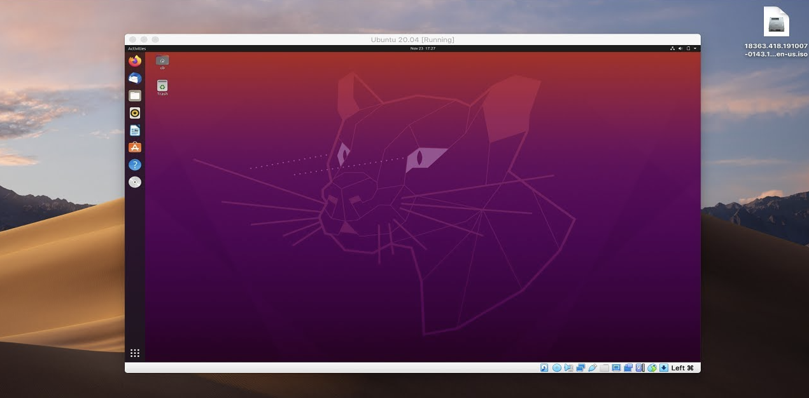

# VirtualBox Installation

I downloaded VirtualBox 6.1 from the official website: https://www.virtualbox.org/wiki/Downloads

The installer package for macOS is named `VirtualBox-6.1.32-149290-OSX.dmg`.

I followed the standard installation process and did not run into any issues.
The installed version of VirtualBox is:

```
VirtualBox Version: 6.1.32r149290
```

## Ubuntu VM Deployment

To create the Ubuntu VM:

-   Launched VirtualBox and clicked on New to create a new VM
-   Named it UbuntuVM, selected Type as Linux and Version as Ubuntu (64-bit)
-   Allocated 2048 MB of RAM
-   Created a new virtual hard disk of 10GB with default settings
-   Enabled PAE/NX for better CPU compatibility
-   Under Network, configured it as Bridged Adapter to get public IP

After configuring these settings, I started the VM which began the Ubuntu installation process. I went through the default install steps like language, keyboard layout, user account creation etc.

Below is a screenshot of the Ubuntu VM successfully running on VirtualBox:

